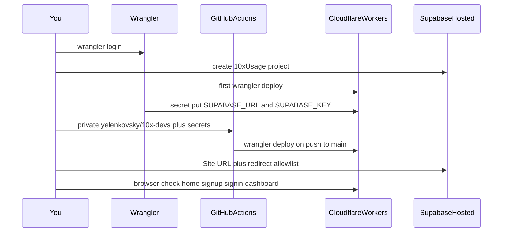

# First Cloudflare Workers deployment

Publish 10xUsage as Cloudflare Worker `10xusage` on `*.workers.dev`, with a dedicated hosted Supabase project and GitHub Actions CI/CD (lint+build on PRs, `wrangler deploy` on merge to `main`). Follows [context/foundation/infrastructure.md](../foundation/infrastructure.md) (Workers, not Pages) and [context/foundation/tech-stack.md](../foundation/tech-stack.md) (GitHub Actions auto-deploy-on-merge).

**Platform:** Cloudflare Workers (`npx astro build && npx wrangler deploy`). Do **not** use Pages, `wrangler pages *`, `wrangler init`, or `astro add cloudflare`. The adapter is already wired.

**Stack:** Astro 6 SSR + React 19 islands + Supabase cookie auth on `@astrojs/cloudflare` v13 / Wrangler 4. Treat `deployment_target: cloudflare-pages` in the original tech-stack hints as stale (this pass set it to `cloudflare-workers`). `ci_provider: github-actions` / `ci_default_flow: auto-deploy-on-merge` is in scope.

## Locked choices

- Worker name: `10xusage`
- Hosted Supabase project: `10xUsage` in org **Xbloc** (`pnouozdiiouamnwgbban`), region `eu-central-1` (Free, $0/month)
- GitHub repo: private `yelenkovsky/10x-devs` as remote `github`; Cursor Origin stays `origin`
- Production deploy on **push to `main`**
- Custom domain, Durable Objects, Workers Builds, and PR preview `versions upload` stay out



## Pre-deploy state

- [wrangler.jsonc](../../wrangler.jsonc) already had the v13 entrypoint `main: "@astrojs/cloudflare/entrypoints/server"`, `nodejs_compat`, assets + custom 404, observability. Cloudflare’s Astro guide still sometimes shows `dist/_worker.js/index.js` — **leave the repo entrypoint as-is**.
- Worker name was still `"10x-astro-starter"`; the account only had Worker `fachstal`. Rename **before** the first publish so the hostname is not wrong.
- Wrangler CLI needed `npx wrangler login` (Cloudflare MCP could list Workers; deploy still needs CLI OAuth).
- No `.dev.vars` / `.env`. Auth reads `SUPABASE_URL` / `SUPABASE_KEY` from `astro:env/server` ([src/lib/supabase.ts](../../src/lib/supabase.ts)). Missing secrets show the Polish “not configured” banner.
- Hosted Supabase had only `fachstal.com`. Local Docker cannot serve production Workers.
- Git remotes: only Cursor Origin (`origin.cursor.com/yelenkovsky/10x-devs`). [`.github/workflows/ci.yml`](../../.github/workflows/ci.yml) lint+built only and triggered on `master`, while the default branch is `main`.

## 1. Config tweak

Change `"name"` in [wrangler.jsonc](../../wrangler.jsonc) to `"10xusage"`.

Add `"deploy": "astro build && wrangler deploy"` in [package.json](../../package.json).

Set `deployment_target` in [context/foundation/tech-stack.md](../foundation/tech-stack.md) from `cloudflare-pages` to `cloudflare-workers`.

After first deploy, pin the auto-provisioned Astro session KV and Images binding in `wrangler.jsonc` so CI reuses them.

## 2. Human gate: Wrangler login

Run `npx wrangler login`. After success, `npx wrangler whoami` prints account ID (needed for `CLOUDFLARE_ACCOUNT_ID`) and the `*.workers.dev` subdomain.

If `workers.dev` is disabled, enable it in the dashboard. Stay on the Free plan unless SSR CPU later exceeds 10 ms.

## 3. Hosted Supabase for production auth

Via Supabase MCP (`confirm_cost` then `create_project`):

- Name `10xUsage`, org `pnouozdiiouamnwgbban`, region `eu-central-1`.
- Wait until `ACTIVE_HEALTHY`.
- Read API URL + an **enabled** anon/publishable key. Write gitignored `.dev.vars`. Never commit it.

No schema migrations: `auth.users` only.

After the Worker URL is known, set Auth **Site URL** to `https://10xusage.<account-subdomain>.workers.dev` and allow redirects on that origin (`/**`). Keep email confirmation on. If Free email is rate-limited, confirm the test user in Studio for the smoke test.

## 4. First production publish (laptop)

Order: **first publish is `wrangler deploy`**, not `versions upload`. Worker secrets need an existing Worker. GitHub Actions must not be the first time the Worker is created if secrets are not set yet — otherwise the live URL would boot with auth unconfigured.

1. `npm run build`
2. `npx wrangler deploy` → `https://10xusage.<subdomain>.workers.dev`
3. `npx wrangler secret put SUPABASE_URL` and `SUPABASE_KEY` (pipe from `.dev.vars`; `secret put` publishes a new version)
4. `npx wrangler secret list` (names only)

No named Wrangler `env` blocks — do not use `--env` / `CLOUDFLARE_ENV`. Later GHA deploys update code; Cloudflare runtime secrets persist (they are not in `wrangler.jsonc` `vars`).

## 5. GitHub Actions CI/CD

Matches tech-stack **auto-deploy-on-merge**. Use GitHub Actions (not Workers Builds). Official path: [GitHub Actions · Cloudflare Workers](https://developers.cloudflare.com/workers/ci-cd/external-cicd/github-actions/) + `cloudflare/wrangler-action@v3`.

**Repo / remotes**

- `gh repo create yelenkovsky/10x-devs --private` (empty, no README — this tree already exists).
- Add remote `github`. Leave Cursor as `origin`.
- Push `main` to `github` after the workflow and first laptop deploy exist.

**Workflow** — extend [`.github/workflows/ci.yml`](../../.github/workflows/ci.yml), do not add a Pages deploy:

- Triggers: `push` and `pull_request` to `main` (replace `master`).
- Job `ci`: `npm ci`, `npx astro sync`, `npm run lint`, `npm run build` with `SUPABASE_URL` / `SUPABASE_KEY` from GitHub secrets.
- Job `deploy`: `needs: ci`, `if: github.event_name == 'push' && github.ref == 'refs/heads/main'`. Checkout, Node 22, `npm ci`, `npm run build`, then:

```yaml
- uses: cloudflare/wrangler-action@v3
  with:
    apiToken: ${{ secrets.CLOUDFLARE_API_TOKEN }}
    accountId: ${{ secrets.CLOUDFLARE_ACCOUNT_ID }}
    command: deploy
```

PRs get lint+build only (no `versions upload` previews this pass). Fork PRs must not deploy.

**Human gate: GitHub secrets**

Create an account-scoped API token in the Cloudflare dashboard: template **Edit Cloudflare Workers**, limited to this account. Then `gh secret set` on `yelenkovsky/10x-devs`:

- `CLOUDFLARE_API_TOKEN`
- `CLOUDFLARE_ACCOUNT_ID` (from `wrangler whoami`)
- `SUPABASE_URL`
- `SUPABASE_KEY`

Do not put those in git or in `wrangler.jsonc` `vars`.

Required token permissions (template is enough): Workers Scripts Edit, Workers KV Storage Edit, Account Settings Read, Workers Tail Read, User Details Read, Memberships Read. Extra template permissions (Pages, Builds, Agents, Observability, Containers, R2) are unused by this app. Zone **Workers Routes: Edit** on `xbloc.dev` is unused while the app stays on `workers.dev`.

**Docs hygiene:** [AGENTS.md](../../AGENTS.md) / [CLAUDE.md](../../CLAUDE.md) one-liners: CI on `main` + deploy-on-merge.

## 6. Verify like a user

- Live Worker: home has no “Supabase nie jest skonfigurowany” banner; sign up → confirm-email; sign in; `/dashboard`; sign out; unauthenticated `/dashboard` redirects to `/auth/signin`.
- After pushing `main` to `github`, `gh run list` / `gh run view` shows `ci` green then `deploy` green.
- If auth dies after secrets, `npx wrangler tail`.

## Outcome (2026-09-12)

| Item | Value |
| --- | --- |
| Live URL | https://10xusage.cloudflare-posted725.workers.dev |
| Worker | `10xusage` |
| Cloudflare account ID | `ce2cae7dc0dffec7759f32d095094832` |
| SESSION KV | `92ff37cc0c1d41238e4ef1c89ac7dcfd` |
| Supabase project | `10xUsage` (`bdnfkpqjqfoaudxdyckx`), `eu-central-1` |
| GitHub | https://github.com/yelenkovsky/10x-devs (private; remote `github`) |
| Cursor Origin | `origin` → `https://origin.cursor.com/yelenkovsky/10x-devs` |
| First green Actions deploy | https://github.com/yelenkovsky/10x-devs/actions/runs/34704688871 |

Laptop `wrangler deploy` + `wrangler secret put` ran first. GitHub secrets `SUPABASE_URL`, `SUPABASE_KEY`, `CLOUDFLARE_ACCOUNT_ID`, and `CLOUDFLARE_API_TOKEN` were set; the first Actions deploy failed until the API token existed, then `ci` + `deploy` went green. Auth Site URL / redirect allowlist were set in the dashboard. Sign-in, dashboard, and sign-out work on the Worker origin. New sign-up can hit Supabase Free **email rate limit**; confirmation then needs Studio confirm or waiting.

## Out of this pass

- Custom domain / Cloudflare nameservers
- Workers Builds Git integration
- PR preview URLs (`wrangler versions upload`)
- Staging named Wrangler envs, Durable Objects, Hyperdrive, Workers Paid
- Product features beyond the starter auth pages
